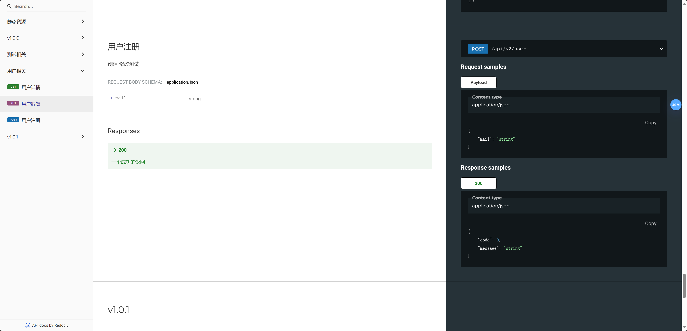

# [pick](https://github.com/actliboy/pick)
一个基于反射的自动注入api开发框架,灵感来自于grpc和springmvc
pick的底层是灵活的,默认基于gin,同时兼容fiber(fasthttp)。

# feature

- 摆脱路由注册
    >❌`xxx.Handle("/"，func(){})`
- 摆脱w,r,摆脱xxx.Context这种不直观输入输出的handler
    >❌`func(w http.ResponseWriter, r *http.Request)`或者`func(ctx xxx.Context){ctx.XXX()}`的业务代码
- 类grpc的函数签名,专注于业务
   > ✅`func(ctx *ginctx.Context,r ReqStruct) (RespStruct,*pick.ErrRep)`

# quick start
go get github.com/hopeio/pick

`go run $(go list -m -f {{.Dir}}  github.com/hopeio/pick)/_example/gin/main.go`

# usage
## main.go
```go
func main() {
  server := gin.New()
  pickgin.Register(server, &UserService{})
  log.Fatal(server.Run(":8080"))
}
```
## service.go
```go
import (
    "github.com/hopeio/context/ginctx"
    "github.com/hopeio/pick"
    "github.com/gin-gonic/gin"
)
// 首先我们需要定义一个服务
type UserService struct{}
//需要实现Service方法，返回该服务的说明，url前缀，以及需要的中间件
func (*UserService) Service() (string, string, []gin.HandlerFunc) {
return "用户相关", "/api/v1/user", []gin.HandlerFunc{}
}
type Req struct{
  ID int `json:"id"`
}
type User struct {
	ID int `json:"id"`
	Name string `json:"name"`
}
// 然后可以写我们的业务方法
func (*UserService) Get(ctx *ginctx.Context, req *Req) (*User, *pick.Er
rRep) {
//对于一个性能强迫症来说，我宁愿它不优雅一些也不能接受每次都调用
  pick.Api(func() {pick.Get(":/id").Title("用户详情").End()})
  return &model.User{ID:req.ID,Name: "测试"}, nil
}

```  
这会生成如下的Api

 >API:	 Get   /api/v1/user/:id   用户详情

 >curl http://localhost:8080/api/v1/user/1  
 > 返回: `{"id":1,"name":"测试"}`  

# 文档生成
/apidoc
pick会为我们生成openapi和markdown文档
当然，这需要你定义的请求配合，例如
```go
type User struct {
	Id uint64 `json:"id"`
	Name string `json:"name" comment:"名字" validate:"gte=3,lte=10"`
	Password string `json:"password" comment:"密码" validate:"gte=8,lte=15"`
	Mail string `json:"mail" comment:"邮箱" validate:"email"`
	Phone string `json:"phone" comment:"手机" validate:"phone"`
}
```
## openapi


## 兼容grpc
```go
func (*UserService) Get(ctx context.Context, req *Req) (*User, error) {
//对于一个性能强迫症来说，我宁愿它不优雅一些也不能接受每次都调用
  pick.Api(func() {
    pick.Get(":/id").
    Title("用户详情").
    CreateLog("1.0.0", "jyb", "2019/12/16", "创建").
    ChangeLog("1.0.1", "jyb", "2019/12/16", "修改测试").
    End()
  })
  return &model.User{ID:req.ID,Name: "测试"}, nil
}
```

# changelog
1. 移除httprouter,默认gin路由
