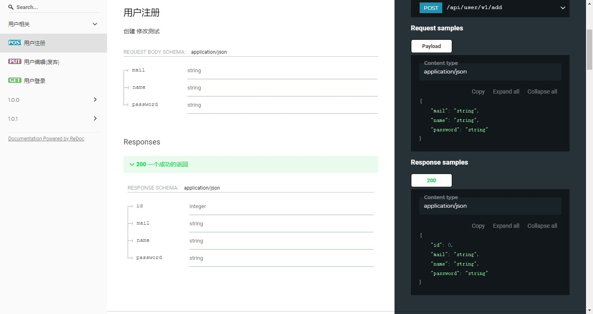

# pick
一款通用的依赖注入的api开发框架

## 特点

- 摆脱路由注册
    >摆脱零散的各处的路由注册 `xxx.Handle("/"，func(){})`
- 摆脱w,r,摆脱xxx.Context
    >不再编写这样`func(w http.ResponseWriter, r *http.Request)`或者`func(ctx xxx.Context){ctx.XXX()}`的业务代码
- 专注于业务
```go
func (*UserService) Add(ctx *model.Claims, req *model.SignupReq) (*model.User, error) {
	//对于一个性能强迫症来说，我宁愿它不优雅一些也不能接受每次都调用
	pick.Api(func() interface{} {
		return pick.Method(http.MethodPost).//定义请求的方法
			Title("用户注册").//接口描述
            Middleware(nil).//中间件
            //接口迭代信息
			CreateLog("1.0.0", "jyb", "2019/12/16", "创建").//创建，唯一
			ChangeLog("1.0.1", "jyb", "2019/12/16", "修改测试").//变更，可有多个
			Deprecated("1.0.0", "jyb", "2019/12/16", "删除")//废弃，唯一
	})

	return &model.User{Name: "测试"}, nil
}

```  
## 使用

go get github.com/liov/pick

## 快速开始

首先我们需要定义一个服务
```go
type UserService struct{}
//需要实现Service方法，返回该服务的说明，url前缀，以及需要的中间件
func (*UserService) Service() (string, string, []http.HandlerFunc) {
    return "用户相关", "/api/user", []http.HandlerFunc{middleware.Log}
}

```
然后可以写我们的业务方法
```go
//不同的api版本在方法名后加V+数字版本
func (*UserService) AddV2(ctx *model.Claims, req *model.SignupReq) (*model.User, error) {
	//对于一个性能强迫症来说，我宁愿它不优雅一些也不能接受每次都调用
	pick.Api(func() interface{} {
		return pick.Method(http.MethodPost).
			Title("用户注册").
			CreateLog("1.0.0", "jyb", "2019/12/16", "创建").
			ChangeLog("1.0.1", "jyb", "2019/12/16", "修改测试")
	})

	return &model.User{Name: "测试"}, nil
}


func (*UserService) Edit(ctx *model.Claims, req *model.User) (*model.User, error) {
	pick.Api(func() interface{} {
		return pick.Method(http.MethodPut).
			Title("用户编辑").
			CreateLog("1.0.0", "jyb", "2019/12/16", "创建").
			Deprecated("1.0.0", "jyb", "2019/12/16", "删除")
	})

	return nil, nil
}

```

这会生成如下的Api
```shell
 API:	 POST   /api/user/v2/add    用户注册
 API:	 PUT    /api/user/v1/edit   用户编辑(废弃)
```
服务有特定的规范,方法名会作为url的结尾,
第一个参数可以用于身份验证，当然你必须自己实现`type Session interface {Parse(*http.Request) error}`
作为一个例子,jwt验证，这会直接在传入我们的业务方法前调用
```go
func (claims *Claims) Parse(req *http.Request) error {

	token := req.Header.Get("Authorization")

	if token == "" {
		return errors.New("未登录")
	}
	tokenClaims, _ := (&jwt.Parser{SkipClaimsValidation: true}).ParseWithClaims(token, claims, func(token *jwt.Token) (interface{}, error) {
		return "TokenSecret", nil
	})

	if tokenClaims != nil {
		if claims, ok := tokenClaims.Claims.(*Claims); ok && tokenClaims.Valid {
			now := time.Now().Unix()
			if claims.VerifyExpiresAt(now, false) == false {
				return errors.New("登录超时")
			}
			return nil
		}
	}
	return errors.New("未登录")
}
```
第二个参数为我们定义的参数，
返回值分别是自定义的返回结构体及错误，

> 作为一个建议这部分可以用protobuf定义，简直完美，当然这样得为第一个参数实现Context

如果是复杂场景呢,我们也是可以注册http.HandlerFunc的
```go
router.Handle(http.MethodGet, "/api-doc/md", "api文档", func(w http.ResponseWriter, req *http.Request) {
			w.Write([]byte(doc))
			w.Header().Set("Content-Type", "text/plain; charset=utf-8")
		})
```
然后，注册我们的服务

```go
func init(){
	pick.RegisterService(&service.UserService{})
}
```
当然你可以注册多个
```go
func init(){
	pick.RegisterService(&service.UserService{},&other.Service{})
}
```
最后启动我们的服务
```go
func main() {
    //是否生成文档
	router := pick.NewRouter(true)
	router.ServeFiles("/static", "E:/")
	log.Println("visit http://localhost:8080")
	log.Fatal(http.ListenAndServe(":8080", router))
}
```
它是如此的简单

## 文档生成

是的，你看到了`pick.NewRouter(true)`,当传入true时，会为我们生成文档
当然，这需要你定义的请求配合，例如
```go
type User struct {
	Id uint64 `json:"id"`
	Name string `json:"name" annotation:"名字" validate:"gte=3,lte=10"`
	Password string `json:"password" annotation:"密码" validate:"gte=8,lte=15"`
	Mail string `json:"mail" annotation:"邮箱" validate:"email"`
	Phone string `json:"phone" annotation:"手机" validate:"phone"`
}
```
如果你需要markdown文档，/api-doc/md
它会为我们生成如下文档
> [TOC]
> 
> # 用户相关  
> ----------
> ## 用户注册-v1(`/api/v1/user/add`)  
> **POST** `/api/v1/user/add` _(Principal jyb)_  
> ### 接口记录  
> |版本|操作|时间|负责人|日志|  
> | :----: | :----: | :----: | :----: | :----: |  
> |1.0.0|创建|2019/12/16|jyb|创建|  
> |1.0.1|变更|2019/12/16|jyb|修改测试|  
> ### 参数信息  
> |字段名称|字段类型|字段描述|校验要求|  
> | :----  | :----: | :----: | :----: |  
> |name|string|名字|长度必须至少为3个字符|  
> |password|string|密码|长度必须至少为8个字符|  
> |mail|string|邮箱|必须是一个有效的手机号!|  
> __请求示例__  
> ```json  
> {
> 	"name": "耰塧囎飿段",
> 	"password": "虱鷅磷黽楑",
> 	"mail": "盬艦潦昊譙"
> }  
> ```  
> ### 返回信息  
> |字段名称|字段类型|字段描述|  
> | :----  | :----: | :----: | 
> |id|number||  
> |name|string|名字|  
> |password|string|密码|  
> |mail|string|邮箱|  
> |mail|string|手机|  
> __返回示例__  
> ```json  
> {
> 	"id": 5454,
> 	"name": "鐷嚅凮珘緻",
> 	"password": "梊朖迍髽栳"
> }  
> ```  
> ## ~~用户编辑-v1(废弃)(`/api/v1/user/edit`)~~  
> **PUT** `/api/v1/user/edit` _(Principal jyb)_  
> ### 接口记录  
> ...

是的，示例并不那么好看，并非不能支持简体字和英文字母，我计划单独写一个mock模块

当然你钟情swagger，也可以`/api-doc/swagger`


